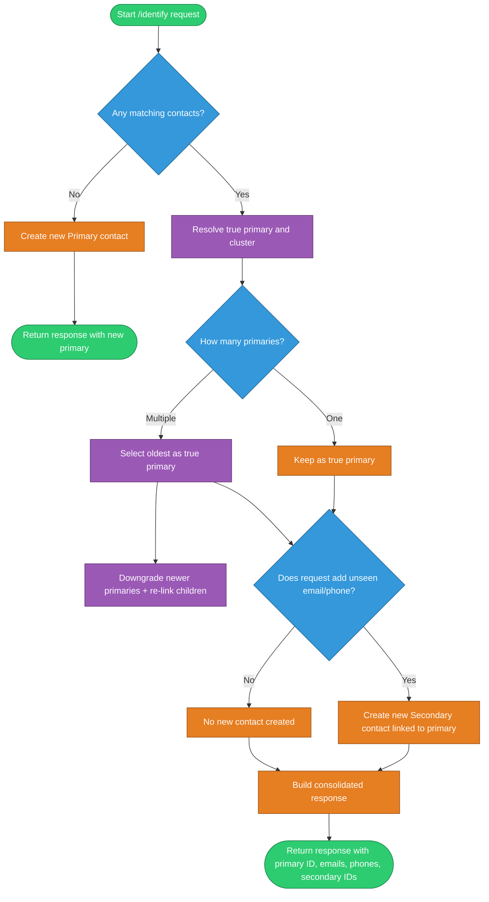

## Identity Reconciliation Service

🔗 [**Live Link**](https://identity-reconciliation-server.vercel.app/)


A minimal Express + TypeScript + Prisma service that reconciles user identities across email and phone, ensuring a single primary contact with linked secondary contacts.

### Tech stack
- **Runtime**: Node.js, TypeScript
- **Web**: Express
- **ORM**: Prisma (PostgreSQL)

### Architecture diagram



### Getting started
1. Install dependencies:
```bash
npm install
```
2. Configure environment:
   - Create a `.env` file with:
```bash
DATABASE_URL="postgresql://<user>:<password>@<host>:<port>/<db>?schema=public"
# Optional
PORT=3000
```
3. Generate client and run migrations:
```bash
npx prisma generate
npx prisma migrate dev
```
4. (Optional) Seed sample data:
```bash
npx prisma db seed
```
5. Start the dev server:
```bash
npm run dev
```

The server will start on `http://localhost:3000` (or `PORT`).

### API
- **POST** `/api/v1/identify`
  - Reconciles the identity using `email` and/or `phoneNumber`, returning the primary contact and deduplicated identifiers.

Request
```json
{
  "email": "rose@bitespeed.com",
  "phoneNumber": "+1-202-555-0199"
}
```

Response
```json
{
  "contact": {
    "primaryContactId": 1,
    "emails": ["rose@bitespeed.com", "r.rose@work.com"],
    "phoneNumbers": ["+1-202-555-0199", "+1-202-555-0123"],
    "secondaryContactIds": [2, 3]
  }
}
```

### Data model (Prisma)
- `Contact` self-references to model primary/secondary linkage
- `linkPrecedence`: `primary` | `secondary`
- Secondary contacts point to the primary via `linkedId`


### Scripts
- **dev**: `nodemon src/index.ts`

### Health check
- `GET /` → returns a simple greeting to verify the service is running.


